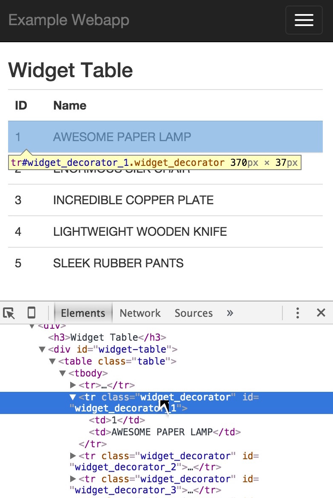
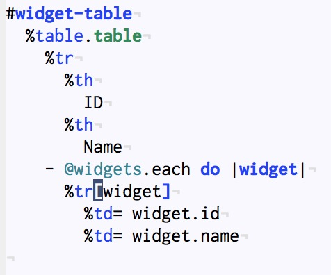

# Rails app demonstrating decorator-based self-schizophrenia

I was curious whether a popular Rails decorator library,
[Draper](https://github.com/drapergem/draper), suffered from
self-schizophrenia issues like showing the wrong IDs in forms, haml,
etc, or exhibiting dispatch/"local rebinding" issues.

I only ended up trying to demonstrate that Draper doesn't integrate with
Haml's auto-id syntax, but that's enough for me (I succeeded).

Screenshots or it didn't happen:

### Wrong ID:

&nbsp;

### The Code:

